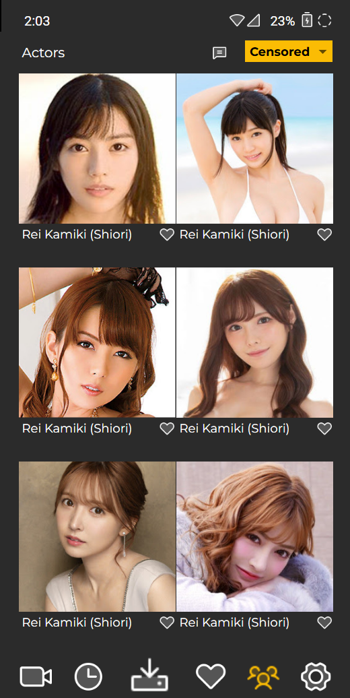

# AI를 활용하여 배우 아바타와 채팅 기능 구현

Project: Flix1 v4.0+ (https://app.notion.com/p/Flix1-v4-0-34dc55e75bd980cb9623e8e403e86908?pvs=21)
Services: X API (https://app.notion.com/p/X-API-221c55e75bd98033b7c2d323deaeb960?pvs=21)
Server list: pmdb.me (https://app.notion.com/p/pmdb-me-221c55e75bd9806fa9d1fa578df11559?pvs=21)
Assigned to : Kenny
Status: Not Started
Sprint: Sprint22 (https://app.notion.com/p/Sprint22-2cdc55e75bd980079521f65c6695ca52?pvs=21)
Higher Level Task: 배우 정보 스크래핑 (https://app.notion.com/p/3ddc55e75bd98007b813df62841745dc?pvs=21)
Priority: Highest
Created by: Kenny
Created time: September 20, 2026 4:26 PM
Github Repo: https://github.com/YOUPERT-INC/chat_with_actor
Google Docs: https://docs.google.com/spreadsheets/d/1iDSbed2W-v0ys6fKRY0TWwXylenbCe5eZ8c1wYV3e1A/edit?gid=182870292#gid=182870292

## How it works?

- X API로 로딩된 배우 리스트에서 유저가 배우를 선택하면
    
    
    
- 배우 프로필 정보와 아바타 이미지, 버튼 및 토글 스위치 표시됨.
    1. 배우 작품 리스트 페이지에 배우 프로필 정보 표시하기 위해 /swx/movie/search?person_id={person_id} API 수정 필요.
    2. Date of birth, Height, Body size, Month of debut, Chat, All titles, User’s pick 등 새로운 텍스트는 앱 언어별로 번역 필요하며
    3. 예를 들어 actress_new 컬렉션에서 Karen Kaede의 경우 다음과 같은 배우 설명은 avdbs.com에서 한국어 설명만 스크래핑 한 것이므로 앱에서 다음과 같은 절차 수행 필요.
        1. description 배열에 앱 언어에 해당하는 번역이 없을 경우 앱에서 직접 Google Translate Unofficial API를 호출하여 번역하고
        2. 번역값을 앱 화면에 표시하는 동시에 별도의 POST API로 actress_new 컬렉션의 해당 문서 description 배열 내 해당 언어 필드 업데이트.
        3. Google Unofficial API 사용은 "C:\ZEROTEAM\scrape_actors\translate_description.py” 참고.
        
        
        
- 유저가 토글 스위치를 All titles에서 User’s pick으로 전환하면 해당 배우 작품 중 {best: true}인 것들만 표시.
    1. 이를 위해서 /swx/movie/search?person_id={person_id} API 뒤에 추가할 best=true 파라미터를 정의해야 함. 
        
        
        
- 유저가 펼침 버튼 누르면 배우에 대한 설명 (description) 영역이 펼쳐지며
    
    
    
- 유저가 [Chat] 버튼 누르면 채팅 창 또는 채팅 목록으로 이동
    1. 기존에 배우와 대화 이력이 없을 경우 바로 채팅 창으로 이동하며
        1. 채팅 창에는 다음과 같은 대화시 주의사항이 상단에 고정되어 있음. 
        2. 앱 언어별로 번역 적용할 것.
            
            
            
            <aside>
            
            This conversation is with an actor's avatar generated by AI, not the real-life actor Karen Kaede. Please note that the AI model used here is programmed to prevent the imitation of real individuals or the engagement in sexually explicit dialogue. However, it can roleplay as a girlfriend or boyfriend based on your gender and preferences. Please be careful not to share sensitive personal information or financial details during the conversation.
            
            </aside>
            
    2. 있을 경우 채팅 목록으로 이동함.
        
        
        
- 기본적으로 텍스트 기반 채팅이며 이미지 전송은 다음과 같이 조건부로 실행 예정. 문서 전송은 금지.
    1. AI 모델의 이미지 읽기/생성 비용이 텍스트에 비해 과도하게 비싸지 않고 허용되어 있을 경우 :
        1. 유저 → AI : Customer support chat처럼 이미지 파일이 일정 크기 이상일 경우 손실압축 후 전송. (기존에 적용된 기술/상세조건은 기억 안남.)
        2. AI → 유저 : 이미지 생성하거나 인터넷에서 저작권 없는 이미지 가져와서 전송할 경우 상기와 동일한 이미지 전송 조건 적용.
    2. 비싸거나 허용되어 있지 않을 경우 : 이미지 전송 금지.
        
        
        
- 이미지 전체화면에서 보기는 Customer support chat과 동일하게 구현하되 위챗페이 영수증 업로드할 일은 없으므로 업로드 버튼은 삭제.
    
    
    

## Things to consider

1. 작품 목록 페이지 상단의 헤드셋 버튼으로 실행되는 고객지원 챗의 UI와 User flow를 재활용 가능함.
2. 스샷은 픽셀 단위로 디자인된 UI가 아닌 구글 시트에 그려진 Wireframe이므로 스샷을 UI 디자인에 적용하지는 말 것.
3. AI 모델 선택에 다음 사항을 고려해야 함.
    1. 가성비가 높을 것.
    2. /swx API가 반환하는 다음 예시와 같은 배우 설명(spec.desc 값)을 학습하여 캐싱하며
    3. 이를 기반으로 유저 대상으로 여자친구 또는 남자친구 역할의 롤플레이를 수행 가능해야 함.